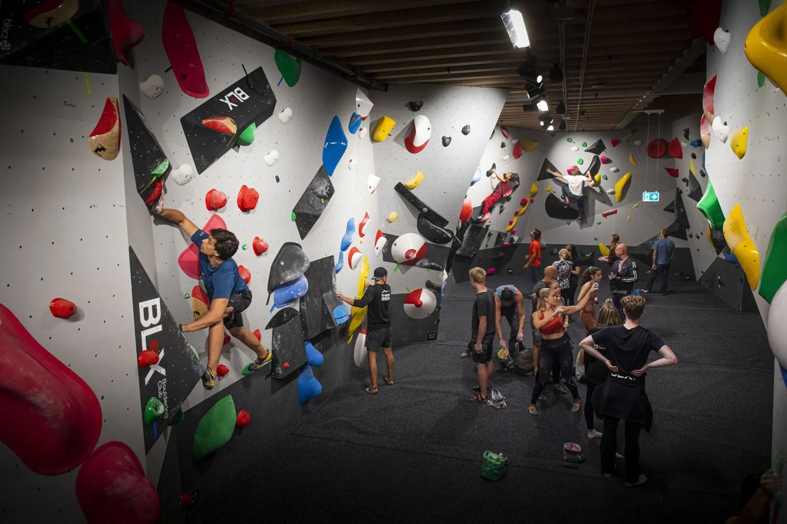

# BLX Bouldering Club

BLX is a bouldering club at Mall of Scandinavia in Stockholm, Sweden. Our spaces bring together climbing, training and community, with routes for a range of experience levels.

The club includes a bouldering hall, a gym, a dedicated kids' area and a rooftop terrace. New to climbing? The First Visit guide covers what to expect, what to bring and practical details for planning a visit.

## Visit the Website

[Open the BLX website](https://lesley-qing-gu.github.io/BLX/)

- [First Visit guide](https://lesley-qing-gu.github.io/BLX/first-visit/)
- Location: Mall of Scandinavia, Stockholm, Sweden
- Opening hours: Daily, 06:30–23:00
